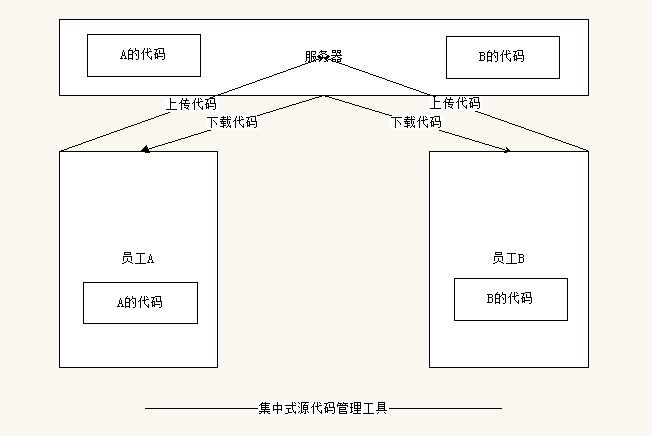
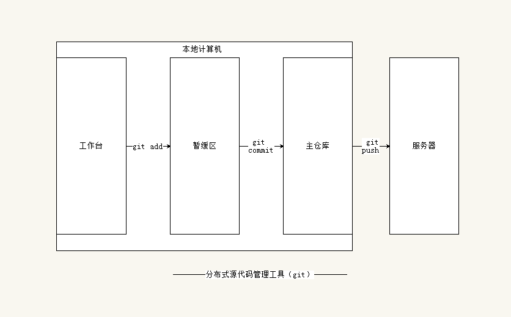

<h1>1.bash命令</h1>

* 1.pwd（print working directory）

  `打印当前活动目录`

* 2.ls（list）

  `列举当前活动目录下的文件夹和文件`

* 3."."

  `.表示当前目录；..表示上一级目录`

* 4.cd（ change the shell working directory）

  `切换活动目录`

* 5.命令 -选项1 -选项2

*命令 -选项1选项2*

​	`ls -a -l || ls -al//列举出当前活动目录下的所有文件夹和文件，并显示详细信息，同时包含两个文件夹：同级和上级目录（./和../）`

* 6.mkdir（make directory）

  `创建文件夹，可以用空格连续创建多个文件夹。默认只能在已有的目录中创建，也可以跟一个'-p'在一个不存在的目录中创建`

* 7.rmdir（remove directory）

  `删除文件夹，只能删除一个空的文件夹`

* 8.rm -rf（remove recursive force）

  `递归删除文件和文件夹并且不显示错误信息（慎用），从当前删除目录的最深的路径开始递归删除`

* 9.touch

  `创建文件 touch 目录/文件名`

* 10.cp(copy)

  `复制指定文件：cp 源文件 新路径`

* 11.mv（move）

  `移动文件：mv 源文件 新路径`

* 12.vi（ Vi IMproved）
  `vim编辑器`
  `i&a&s进入编辑模式`
  `Esc退出编辑模式`
  `:w - 保存`
  `:q - 退出编辑器`
  `:wq - 保存并退出编辑器`

***

<h1>2.Git</h1>

<h3>概念<h3>
* 源代码管理工具，利于个人和团队之间的协助开发

---

<h3>种类</h3>
* 本地源代码管理
* 集中式源代码管理工具（svn）
* 分布式源代码管理工具（git）

<h3>基本操作<h3>
* 1.git init(初始化文件夹)//一定要明确哪个文件夹被git管理起来

* 2.在往git工作台中添加文件的时候（非文件夹），状态是未追踪（Untracked）

* 3.git status(查看工作台相关文件的状态)，如果是空文件夹或者空文件夹包含空文件夹，则不会显示在其中

* 4.git add 文件名（将指定的文件存放到暂存区），把文件存放到暂存区后文件的状态是待提交（changes to be committed）
  `git add *(将工作台中所有未追踪的文件提交到暂存区中)`
  `git add .(将当前目录下的未追踪的文件提交到暂存区中)`

* 5.当修改了文件之后，也可以是用git add命令来提交到暂存区

* 6.关于用户名和邮箱的配置
  `如果是第一次使用git，需要配置用户名和邮箱才能将暂存区的内容提交到本地主仓库中`
  `git config user.name XXX(配置用户名)`
  `git config user.email XXX(配置邮箱)`
  `也可以通过：git config --global user.xxx XXX 来统一创建本地计算机的用户名和邮箱，这样当新建一个git管理后就不用再次配置用户名和邮箱`

* 7.git commit
  `git commit 将代码提交到主仓库中，需要在vi编辑器中书写日志`
  `也可以git commit -m 日志内容`

* 8.git push 服务器仓库的地址(https) master(将本地主仓库的代码上传到服务器中去)

